<p align="center">
  
</p>

<div align="center">

# DSH Codex Desktop

**Download once. Open a ready-to-use local AI workspace.**

[简体中文](README.zh-CN.md) · [Download](https://github.com/MichengAI/dsh-codex-desktop/releases) · [Changelog](CHANGELOG.md) · [Report an issue](https://github.com/MichengAI/dsh-codex-desktop/issues)

[](https://github.com/MichengAI/dsh-codex-desktop/releases)
[](LICENSE)
[](https://github.com/MichengAI/dsh-codex-desktop/actions/workflows/desktop-package.yml)


</div>

> DSH Codex Desktop is a community-maintained desktop distribution of DeepSeek Harness. It is not an official DeepSeek AI product.

DSH Codex Desktop turns [DeepSeek Harness](https://github.com/deepseek-ai/deepseek-harness) into a native, ready-to-run desktop workbench. The installer includes the required Node.js runtime and local DSH runtime: install it, open it, then start working. You do not need to prepare a Node.js environment or launch DSH from a terminal.

## Download and start

Get the current installer from [GitHub Releases](https://github.com/MichengAI/dsh-codex-desktop/releases).

| Platform | Package | Start here |
| --- | --- | --- |
| Windows x64 | `.exe` installer or `.zip` archive | Run the installer, then open **DSH Codex Desktop** from the Start menu. |
| macOS Apple Silicon / Intel | `.dmg` installer | Open the disk image, move the app to Applications, then launch it. |
| Linux x64 / ARM64 | `.AppImage` or Debian / Ubuntu `.deb` | Run the package matching your CPU architecture, or install the deb package, then launch the app. |

1. Download the package for your platform.
2. Install and open **DSH Codex Desktop**.
3. Wait for the built-in local DSH service to finish starting.
4. Create a task, select a model and permission mode, then work in your project.

The application keeps DSH data in your existing user profile (`%USERPROFILE%\.dsh` on Windows), so sessions and settings remain available after application upgrades.

## A complete desktop workbench

| Capability | What you get |
| --- | --- |
| **Desktop conversation workspace** | Project and task navigation, conversation sessions, model selection, permissions, session logs, and a focused desktop window. |
| **Expert presets** | Enable specialist roles for code review, architecture, frontend, backend, operations, and other workflows. |
| **Skill center** | Inspect, enable, disable, upload, and manage local and shared Agent skills from Settings. |
| **Archive management** | Search archived conversations, restore a session when needed, or permanently remove archived records. |
| **IM assistant** | Configure DingTalk, Feishu, Lark, WeChat, WeCom, QQ, Telegram, and other available channels in one place. |
| **Plugin market** | Discover, install, update, enable, and diagnose DSH plugins without leaving the desktop client. |
| **MCP connector** | Add and manage MCP services through OAuth, API keys, HTTP, stdio, or JSON configuration. |
| **Scheduled automation** | Use the built-in DSH scheduling capability to manage recurring tasks from the same workspace. |
| **Safe local runtime** | The app starts DSH on a validated loopback address and keeps the browser UI inside the desktop shell. |

## Product preview

Explore the desktop workspace, light-theme settings, and plugin management pages. The home screen and 11 settings and plugin screenshots come from the newly supplied desktop captures; the conversation, context, sidebar, and Git graph previews are retained from earlier captures. Plugin versions, counts, and states reflect each capture. Click any image to view it at its original resolution.

<p align="center"><em>Home: project navigation, task entry points, and composer.</em></p>

<p align="center"><a href="assets/screenshots/preview-home.webp">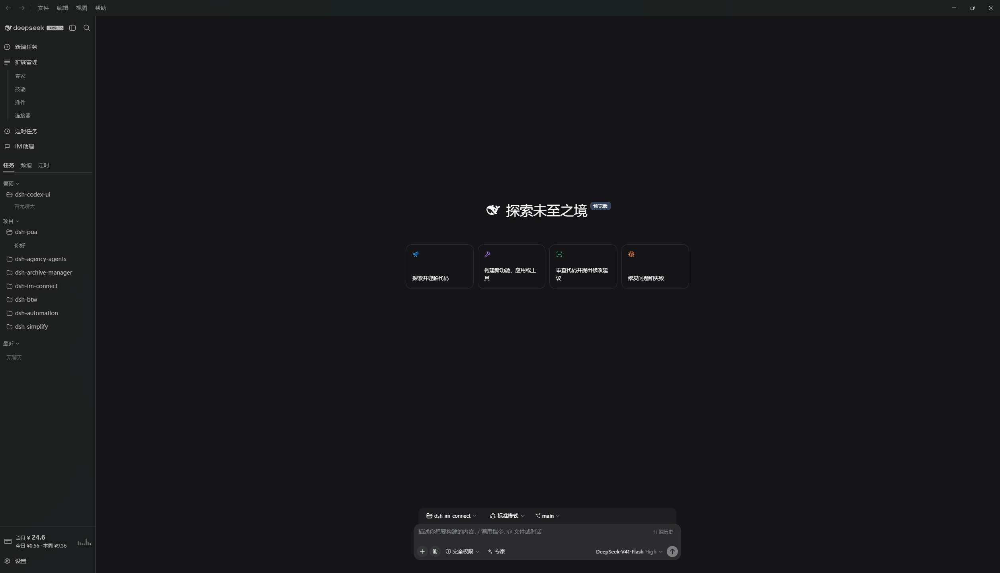</a></p>

<p align="center"><em>Conversation: messages, trajectory, context, and task input.</em></p>

<p align="center"><a href="assets/screenshots/preview-conversation.webp">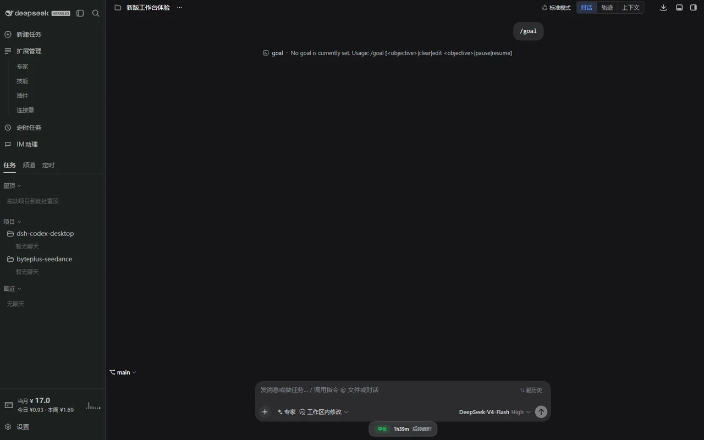</a></p>

<details>
<summary>Appearance and desktop pets (2 screenshots)</summary>

<p align="center"><em>Light-theme settings: permissions, language, appearance, and editor preferences.</em></p>

<p align="center"><a href="assets/screenshots/preview-general-light.webp">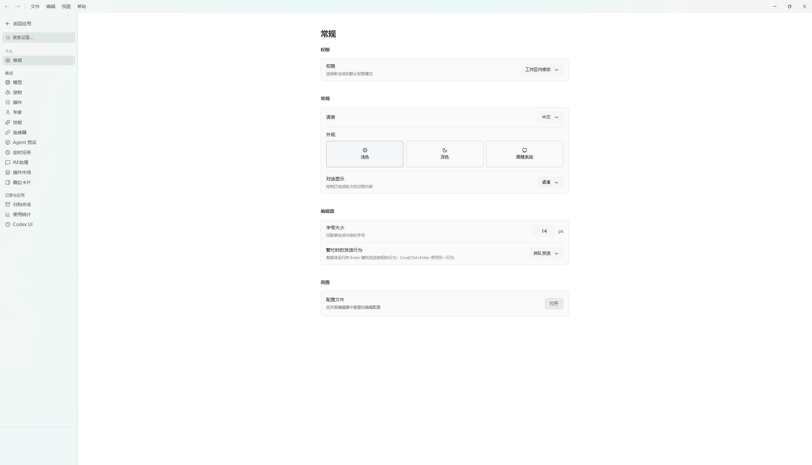</a></p>

<p align="center"><em>Pet settings: choose a companion, manage custom pets, and adjust size.</em></p>

<p align="center"><a href="assets/screenshots/preview-pets.webp">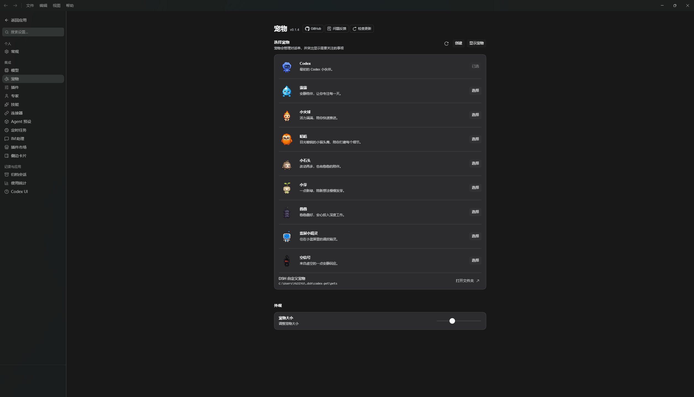</a></p>

</details>

<details>
<summary>Our plugin pages (6 screenshots)</summary>

<p align="center"><em>Expert presets: filter, search, and enable specialist roles.</em></p>

<p align="center"><a href="assets/screenshots/preview-experts.webp">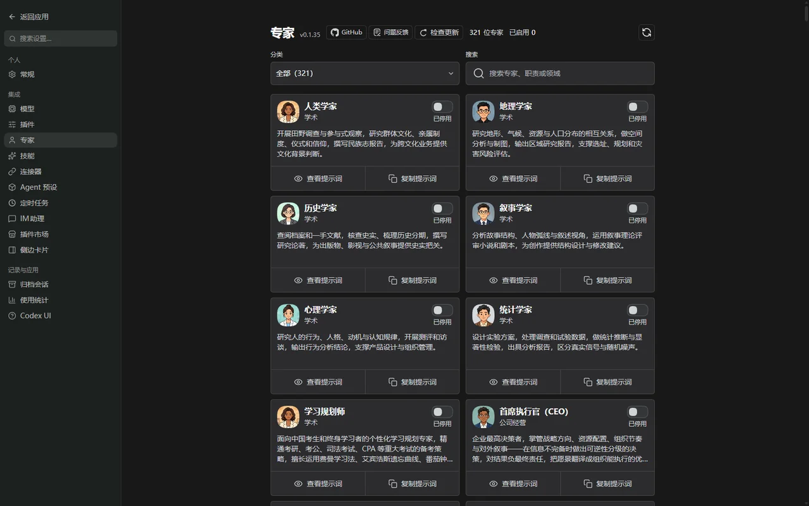</a></p>

<p align="center"><em>Skill management: manage local Agent Skills across sources.</em></p>

<p align="center"><a href="assets/screenshots/preview-skills.webp">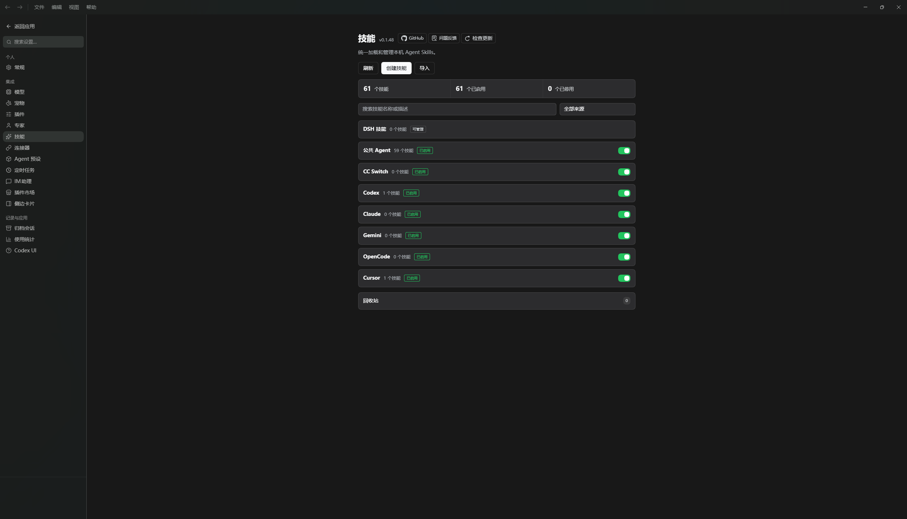</a></p>

<p align="center"><em>Scheduled automation: examples, task schedules, and run history access.</em></p>

<p align="center"><a href="assets/screenshots/preview-automation.webp">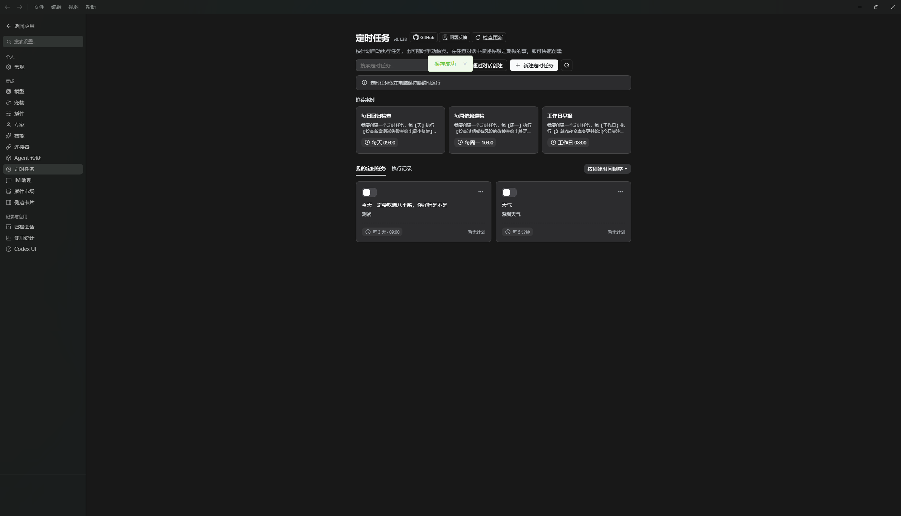</a></p>

<p align="center"><em>IM assistant: manage messaging channels, accounts, and incoming messages.</em></p>

<p align="center"><a href="assets/screenshots/preview-im-connect.webp">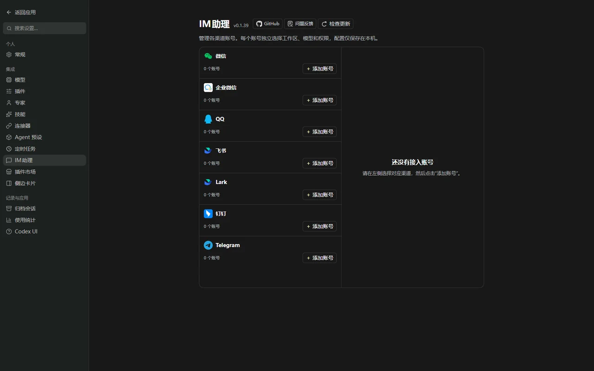</a></p>

<p align="center"><em>Archived conversations: filter by project, search, and restore past chats.</em></p>

<p align="center"><a href="assets/screenshots/preview-archive.webp">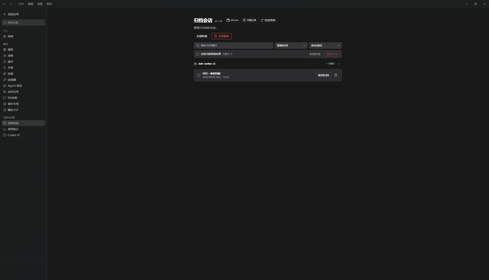</a></p>

<p align="center"><em>Codex UI settings: feature overview and companion plugin installation status.</em></p>

<p align="center"><a href="assets/screenshots/preview-codex-ui.webp">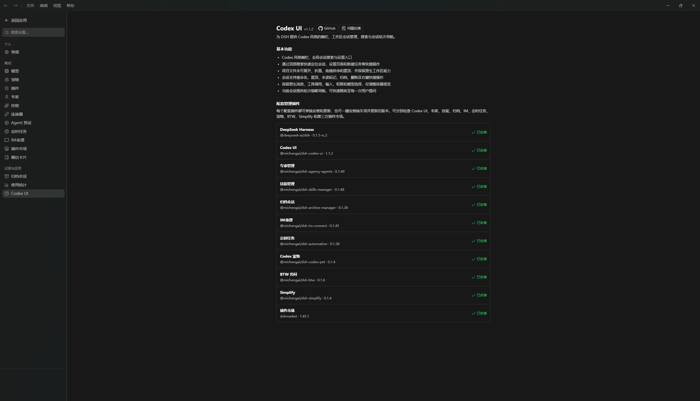</a></p>

</details>

<details>
<summary>Community plugin pages (6 screenshots)</summary>

<p align="center"><em>Context settings</em></p>

<p align="center"><a href="assets/screenshots/preview-context.webp">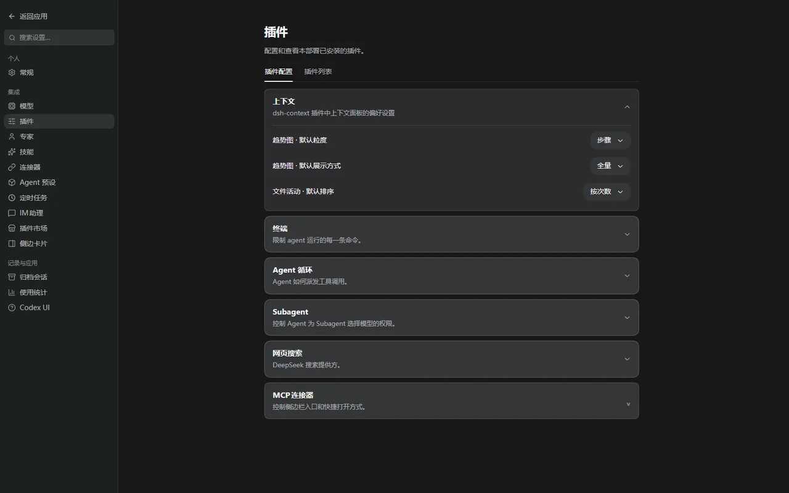</a></p>

<p align="center"><em>Sidebar settings</em></p>

<p align="center"><a href="assets/screenshots/preview-sidebar.webp">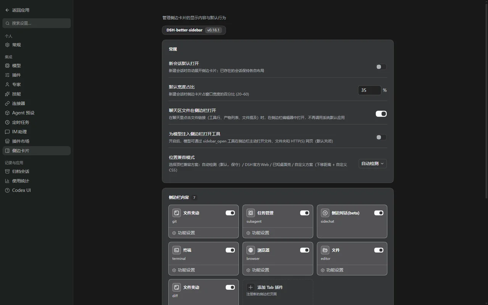</a></p>

<p align="center"><em>MCP connector: browse services by category and add connections.</em></p>

<p align="center"><a href="assets/screenshots/preview-mcp-connector.webp">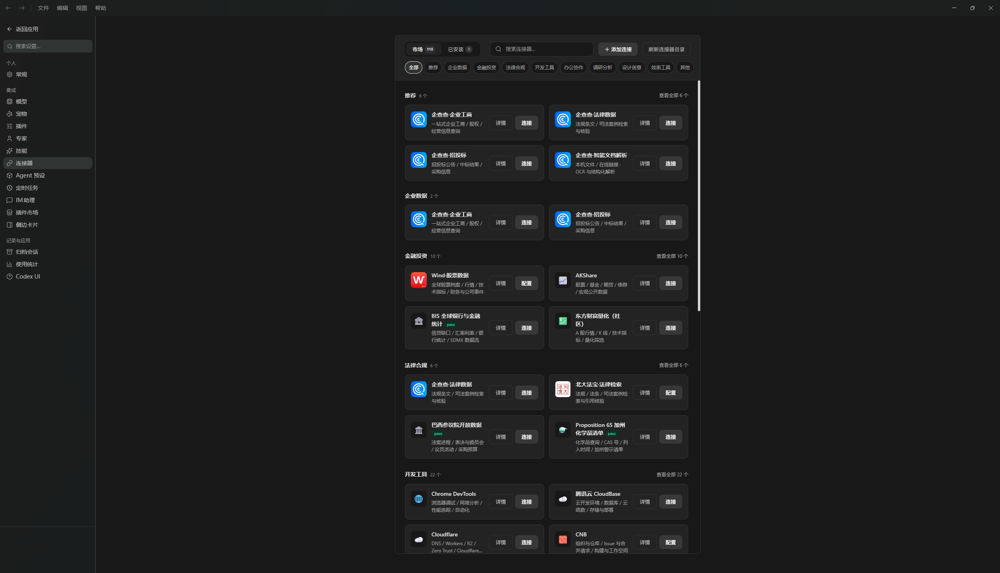</a></p>

<p align="center"><em>Usage statistics: costs, tokens, cache hit rate, and activity heatmap.</em></p>

<p align="center"><a href="assets/screenshots/preview-usage-billing.webp">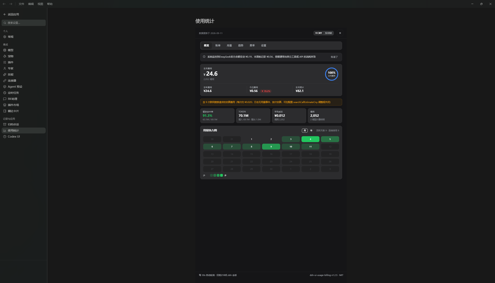</a></p>

<p align="center"><em>Plugin market: discover community plugins and inspect installation and update status.</em></p>

<p align="center"><a href="assets/screenshots/preview-plugin-market.webp">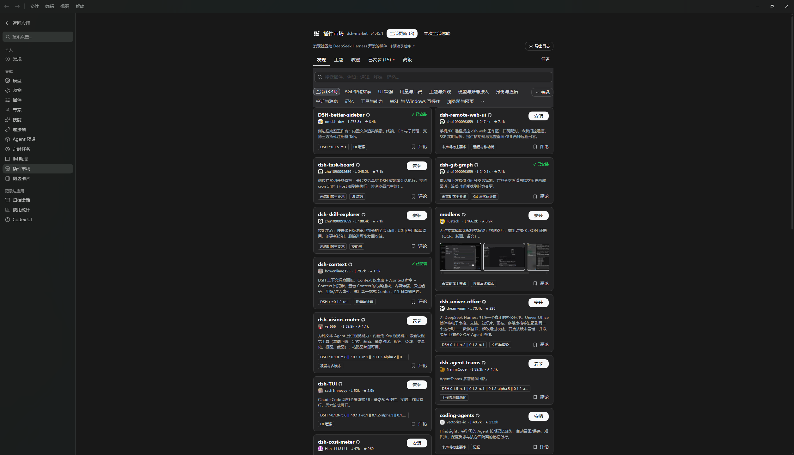</a></p>

<p align="center"><em>Git commit graph</em></p>

<p align="center"><a href="assets/screenshots/preview-git-graph.webp">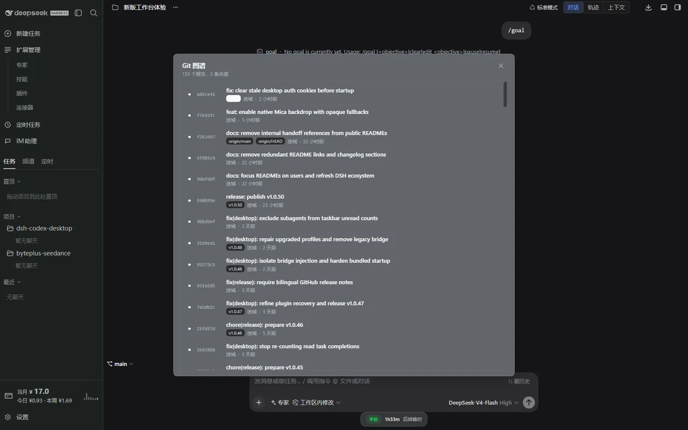</a></p>

</details>

## Included on first launch

The installer ships with the local runtime required to start DSH. On first launch, it prepares the desktop-facing community plugins in the Web profile:

| Included capability | Package |
| --- | --- |
| Codex-style workspace UI | [`@michengai/dsh-codex-ui`](https://github.com/MichengAI/dsh-codex-ui) |
| Native desktop pet and conversation notifications | [`@michengai/dsh-codex-pet`](https://github.com/MichengAI/dsh-codex-pet) |
| Expert preset management | [`@michengai/dsh-agency-agents`](https://github.com/MichengAI/dsh-agency-agents) |
| Skill management | [`@michengai/dsh-skills-manager`](https://github.com/MichengAI/dsh-skills-manager) |
| Archive management | [`@michengai/dsh-archive-manager`](https://github.com/MichengAI/dsh-archive-manager) |
| IM assistant | [`@michengai/dsh-im-connect`](https://github.com/MichengAI/dsh-im-connect) |
| Scheduled automation | [`@michengai/dsh-automation`](https://github.com/MichengAI/dsh-automation) |
| Context inspection and management | [`dsh-context`](https://github.com/bowenliang123/dsh-context) |
| Extensible workspace sidebar | [`dsh-better-sidebar`](https://github.com/omdsh-dev/DSH-better-sidebar) |
| MCP connection management | [`dsh-mcp-connector`](https://github.com/duhu2000/dsh-mcp-connector) |
| Usage and cost tracking | [`@kenz1117/dsh-ui-usage-billing`](https://github.com/kenz1117/dsh-ui-usage-billing) |
| Git commit graph | [`@linxin666/dsh-client-ui-git-graph`](https://github.com/zhu1090093659/dsh-web) |
| One-off read-only side questions | [`@michengai/dsh-btw`](https://github.com/MichengAI/dsh-btw) |
| Code simplification scoped to Git changes | [`@michengai/dsh-simplify`](https://github.com/MichengAI/dsh-simplify) |

You can later manage additional plugins from the plugin market. The desktop application keeps its own runtime separate from profile-installed community plugins so plugin changes do not overwrite the application runtime.

The desktop bridge ships with the app and is injected only when Desktop starts DSH; it does not need to be installed in the shared Web profile. Running `dsh web` manually uses Web's own plugin management path. Desktop migrates and backs up bridge configuration left by older versions on startup.

## DSH product ecosystem

For a ready-to-use workbench, download [DSH Codex Desktop](https://github.com/MichengAI/dsh-codex-desktop/releases). If you already use [DeepSeek Harness](https://github.com/deepseek-ai/deepseek-harness), install any of these eight plugins individually. The desktop app includes all eight.

| Plugin | What you can do |
| --- | --- |
| [Codex UI](https://github.com/MichengAI/dsh-codex-ui) | Organize projects and conversations, search tasks, and navigate chat turns |
| [IM Connect](https://github.com/MichengAI/dsh-im-connect) | Send tasks and receive replies through your usual messenger |
| [Automation](https://github.com/MichengAI/dsh-automation) | Schedule tasks and review each run |
| [Skills Manager](https://github.com/MichengAI/dsh-skills-manager) | Find, enable, create, and import local skills |
| [Archive Manager](https://github.com/MichengAI/dsh-archive-manager) | Search, restore, or clean up archived conversations |
| [Agency Agents](https://github.com/MichengAI/dsh-agency-agents) | Choose and summon specialists for your task |
| [BTW](https://github.com/MichengAI/dsh-btw) | Ask side questions without interrupting the main task |
| [Simplify](https://github.com/MichengAI/dsh-simplify) | Use /simplify to improve code within your Git changes |

The desktop app also integrates [DSH Context](https://github.com/bowenliang123/dsh-context), [DSH Better Sidebar](https://github.com/omdsh-dev/DSH-better-sidebar), [DSH MCP Connector](https://github.com/duhu2000/dsh-mcp-connector), [Usage Billing](https://github.com/kenz1117/dsh-ui-usage-billing) and the plugin market for context insights, file navigation, connections, and usage statistics.

## Updates and recovery

- **Desktop updates** are checked after startup by default and notify you when a new release is available. Settings → Updates can instead download releases automatically or switch to manual-only checks. Installation and restart always require an explicit action.
- **DSH reload** is available from the tray menu after changing plugins or profile configuration; it restarts the local DSH service without reinstalling the desktop application.
- **Plugin updates** remain in the DSH settings and plugin market. A failed plugin installation is not activated as a running bundle.
- **Startup recovery** removes stale community-plugin registrations that no longer have an installed package, then retries the local DSH startup.

## System requirements

| Item | Requirement |
| --- | --- |
| Operating system | Windows 10/11, macOS, or Linux |
| Architecture | Windows x64, macOS arm64/x64, or Linux x64/arm64 |
| Node.js | Not required for end users; bundled with the application |
| Network | Required only for the model providers, plugin downloads, and tools you choose to use |

## Privacy and security

- DSH configuration, sessions, and credentials remain in the current user's DSH directory. Uninstalling the desktop app does not delete them.
- The launcher accepts only validated `127.0.0.1` local HTTP addresses for its embedded window.
- External HTTP(S) links open in the system browser. File, JavaScript, and data URLs are blocked.
- Electron uses context isolation and sandboxing, with Node.js integration disabled for the DSH page.
- Your configured model providers and DSH tools may make their own network requests. Review their settings and privacy policies before use.

## Development

### Bundled pet integration

The bundled `@michengai/dsh-codex-pet` 0.1.2 is distributed offline and installed automatically on first launch. Select a pet and enable visibility in pet settings to use the native companion. The plugin exposes `window.dshPet` API version 1. Desktop subscribes to snapshots and forwards conversation actions through that API; Desktop owns rendering, dragging, position storage, click-through and window recovery. The plugin remains usable in a web browser without Desktop. Older plugins exposing only `dshDesktopPet` are not supported by this adapter.

Run `npm run smoke:pet` to build and verify real Electron windows, preload/IPC, multi-session approval and answers, stale-command rejection, reload, hide and display handoff. The test uses a protocol fixture and a tiny image fixture, requires only this repository's development dependencies, and cleans its temporary user directory. It does not replace an installed-plugin or packaged-release acceptance test.

Development requires Windows, Node.js `24.20.0`, and pnpm `11.24.0`.

```powershell
[Console]::OutputEncoding = [System.Text.Encoding]::UTF8
$OutputEncoding = [System.Text.Encoding]::UTF8
pnpm install --frozen-lockfile
pnpm test
pnpm run dist
```

Local build artifacts are written to `release\` and are not committed. Pushing a `vX.Y.Z` tag starts the packaging workflow for Windows x64, macOS arm64/x64, and Linux x64/arm64 AppImage / deb artifacts.

## License

This project is licensed under [Apache License 2.0](LICENSE).
