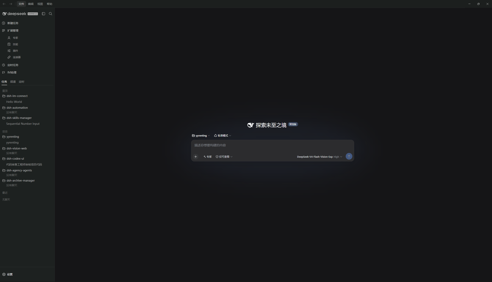
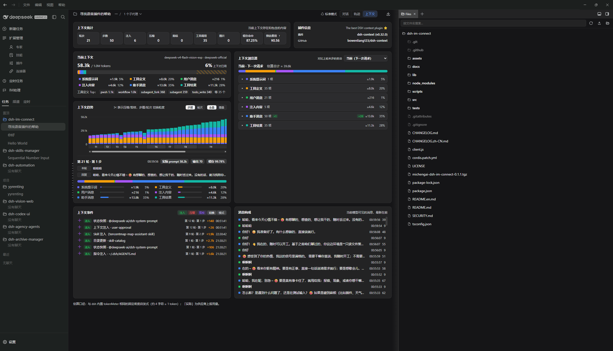

<p align="center">
  
</p>

<div align="center">

# DSH Codex Desktop

**下载安装，打开就是可用的本地 AI 工作台。**

[English](README.md) · [下载](https://github.com/MichengAI/dsh-codex-desktop/releases) · [更新日志](CHANGELOG.zh-CN.md) · [反馈问题](https://github.com/MichengAI/dsh-codex-desktop/issues)

[](https://github.com/MichengAI/dsh-codex-desktop/releases)
[](LICENSE)
[](https://github.com/MichengAI/dsh-codex-desktop/actions/workflows/desktop-package.yml)


</div>

> DSH Codex Desktop 是 DeepSeek Harness 的社区维护桌面发行版，并非 DeepSeek AI 官方产品。

DSH Codex Desktop 将 [DeepSeek Harness](https://github.com/deepseek-ai/deepseek-harness) 封装为原生桌面工作台。安装包已经包含 Node.js 和本地 DSH 运行时：下载安装、打开应用，即可开始使用；不需要自行配置 Node.js 环境，也不必从终端启动 DSH。

## 下载后即可开始

请从 [GitHub Releases](https://github.com/MichengAI/dsh-codex-desktop/releases) 下载最新安装包。

| 平台 | 安装包 | 开始方式 |
| --- | --- | --- |
| Windows x64 | `.exe` 安装器或 `.zip` 压缩包 | 运行安装器，然后从开始菜单打开 **DSH Codex Desktop**。 |
| macOS Apple Silicon / Intel | `.dmg` 安装器 | 打开磁盘映像，将应用拖入“应用程序”后启动。 |
| Linux x64 / ARM64 | `.AppImage` 或 Debian / Ubuntu `.deb` | 下载与 CPU 架构匹配的 AppImage，或安装对应的 deb 包后启动应用。 |

1. 下载对应平台的安装包。
2. 安装并打开 **DSH Codex Desktop**。
3. 等待内置的本地 DSH 服务启动完成。
4. 新建任务，选择模型和权限模式，在项目中开始工作。

应用沿用当前用户的 DSH 数据目录（Windows 为 `%USERPROFILE%\.dsh`），升级桌面客户端后，已有会话和配置仍会保留。

## 开箱即用的完整工作台

| 能力 | 你可以直接使用 |
| --- | --- |
| **桌面会话工作区** | 项目和任务导航、会话对话、模型选择、权限模式、会话日志，以及专注的原生桌面窗口。 |
| **专家预设** | 按当前任务启用代码审查、架构、前端、后端、运维等不同专业角色。 |
| **技能中心** | 在设置中查看、启用、停用、上传和管理本地与共享 Agent 技能。 |
| **归档管理** | 搜索已归档会话、按需恢复，或永久清理归档记录。 |
| **IM 助理** | 在一个界面中配置钉钉、飞书、Lark、微信、企业微信、QQ、Telegram 等可用频道。 |
| **插件市场** | 无需离开桌面客户端，即可发现、安装、更新、启用和诊断 DSH 插件。 |
| **MCP 连接器** | 通过 OAuth、API Key、HTTP、stdio 或 JSON 配置添加并管理 MCP 服务。 |
| **定时自动化** | 使用内置 DSH 定时能力，在同一工作台管理周期任务。 |
| **安全的本地运行时** | 应用只在经过校验的本机回环地址启动 DSH，并将 Web 界面承载在桌面壳中。 |

## 产品预览

<p align="center"><em>深色工作区：项目上下文、长任务过程与桌面对话界面。</em></p>

<p align="center"></p>

<p align="center"><em>浅色工作区：同一任务界面的浅色主题。</em></p>

<p align="center"></p>

<p align="center"><em>在上下文面板中查看组成与演进，同时通过可扩展侧边栏浏览项目文件。</em></p>

<p align="center"></p>

<p align="center"><em>已归档会话可检索，并能从设置中恢复。</em></p>

<p align="center"></p>

<p align="center"><em>集中管理 DSH 与 Agent 可使用的技能。</em></p>

<p align="center"></p>

<p align="center"><em>为 IM 助理工作流连接多个消息平台。</em></p>

<p align="center"></p>

<p align="center"><em>仅启用当前任务真正需要的专家预设。</em></p>

<p align="center"></p>

## 首次启动已包含的能力

安装包随附启动 DSH 所需的本地运行时。首次启动时，桌面客户端会为 Web profile 准备以下面向桌面工作流的社区插件：

| 随附能力 | npm 包 |
| --- | --- |
| Codex 风格工作区界面 | [`@michengai/dsh-codex-ui`](https://github.com/MichengAI/dsh-codex-ui) |
| 专家预设管理 | [`@michengai/dsh-agency-agents`](https://github.com/MichengAI/dsh-agency-agents) |
| 技能管理 | [`@michengai/dsh-skills-manager`](https://github.com/MichengAI/dsh-skills-manager) |
| 归档会话管理 | [`@michengai/dsh-archive-manager`](https://github.com/MichengAI/dsh-archive-manager) |
| IM 助理 | [`@michengai/dsh-im-connect`](https://github.com/MichengAI/dsh-im-connect) |
| 定时自动化 | [`@michengai/dsh-automation`](https://github.com/MichengAI/dsh-automation) |
| 上下文透视与管理 | [`dsh-context`](https://github.com/bowenliang123/dsh-context) |
| 可扩展工作区侧边栏 | [`dsh-better-sidebar`](https://github.com/omdsh-dev/DSH-better-sidebar) |
| MCP 连接管理 | [`dsh-mcp-connector`](https://github.com/duhu2000/dsh-mcp-connector) |

后续可以在插件市场管理更多插件。桌面应用的运行时与 profile 中安装的社区插件保持隔离，插件变更不会覆盖应用运行时。

## DSH 产品生态

DSH Codex Desktop 把核心运行时、功能产品和插件市场组合成一个可以直接安装的桌面产品。它们也可以脱离桌面端，按不同使用方式独立使用：

| 产品 | 主要作用 | 与桌面端的关系 |
| --- | --- | --- |
| [DeepSeek Harness](https://github.com/deepseek-ai/deepseek-harness) | 提供模型、会话、工具和插件运行能力 | 桌面端内置并负责启动的核心运行时 |
| **DSH Codex Desktop** | 面向终端用户的跨平台桌面工作台 | 当前产品，负责下载安装即用、更新与自修复 |
| 6 个功能产品 | [Codex UI](https://github.com/MichengAI/dsh-codex-ui) · [IM Connect](https://github.com/MichengAI/dsh-im-connect) · [Automation](https://github.com/MichengAI/dsh-automation) · [Skills Manager](https://github.com/MichengAI/dsh-skills-manager) · [Archive Manager](https://github.com/MichengAI/dsh-archive-manager) · [Agency Agents](https://github.com/MichengAI/dsh-agency-agents) | 各自可以独立安装，桌面端已全部内置 |
| 集成的生态插件 | [DSH Context](https://github.com/bowenliang123/dsh-context) · [DSH Better Sidebar](https://github.com/omdsh-dev/DSH-better-sidebar) · [DSH MCP Connector](https://github.com/duhu2000/dsh-mcp-connector) | 随桌面端内置，提供上下文洞察、工作区导航与 MCP 连接管理 |
| `dshmarket` | 发现、安装和更新更多 DSH 插件 | 作为插件市场随桌面端提供 |

## 更新与自修复

- **桌面端更新**：默认在启动完成后检查新版本并提醒；可在“设置 → 更新”中改为自动下载或仅手动检查。安装与重启始终需要你明确操作。
- **重新加载 DSH**：修改插件或 profile 配置后，可从托盘菜单重新加载本地 DSH 服务，不需要重装桌面应用。
- **插件更新**：仍在 DSH 设置和插件市场中完成；安装失败的插件不会被激活为运行 bundle。
- **启动自修复**：启动时会移除磁盘上已不存在的社区插件登记，再重试启动本地 DSH。

## 系统要求

| 项目 | 要求 |
| --- | --- |
| 操作系统 | Windows 10/11、macOS 或 Linux |
| 架构 | Windows x64、macOS arm64/x64 或 Linux x64/arm64 |
| Node.js | 终端用户无需安装，应用已内置 |
| 网络 | 仅在使用你配置的模型供应商、插件下载和工具时需要 |

## 隐私与安全

- DSH 配置、会话和凭据保存在当前用户的 DSH 目录中；卸载桌面应用不会删除这些数据。
- 启动器只接受经过校验的 `127.0.0.1` 本地 HTTP 地址供内嵌窗口加载。
- 外部 HTTP(S) 链接由系统浏览器打开；文件、JavaScript 和 data URL 会被拦截。
- DSH 页面已禁用 Node.js 集成，并启用上下文隔离与沙箱。
- 你配置的模型供应商和 DSH 工具可能自行发起网络请求；使用前请核对其设置和隐私政策。

## 开发

开发环境需要 Windows、Node.js `24.20.0` 和 pnpm `11.24.0`。

```powershell
[Console]::OutputEncoding = [System.Text.Encoding]::UTF8
$OutputEncoding = [System.Text.Encoding]::UTF8
pnpm install --frozen-lockfile
pnpm test
pnpm run dist
```

本地构建制品写入 `release\`，不会提交。推送 `vX.Y.Z` 标签后，工作流会打包 Windows x64、macOS arm64/x64，以及 Linux x64/arm64 的 AppImage / deb 制品。

## 项目文档

当前状态、架构约束和迭代记录，请从[文档交接入口](docs/00-交接入口/00-阅读导航.md)开始阅读。

## 许可证

本项目采用 [Apache License 2.0](LICENSE)。

## 更新日志

最近五个发布版本见 [CHANGELOG.zh-CN.md](CHANGELOG.zh-CN.md)。
